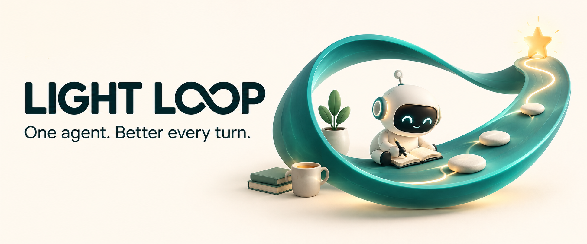

# Light Loop

[](https://github.com/game-dev-rta-club/light-loop/actions/workflows/ci.yml)
[](https://github.com/game-dev-rta-club/light-loop/releases/latest)
[](LICENSE)



**Let the agent keep going—and get better at how it works.**

Light Loop turns a goal into focused, continuing work in Codex. The same agent makes progress, learns from the result, and improves its next approach. No agent team to coordinate. No loop engine to install. Just [one short skill](skills/light-loop/SKILL.md) and Codex's native Goal feature.

[Why use a loop?](#new-to-loop-engineering) · [What makes it light?](#already-using-loops) · [Try it](#try-it)

## New to loop engineering?

An agent loop works toward an outcome over multiple turns: do a useful piece of work, look at the result, and choose what to do next. You ask for the outcome instead of directing every iteration yourself.

Light Loop gives that work three useful properties:

- **A goal beyond one reply.** Codex's Goal continuation carries the work into the next turn.
- **One purpose at a time.** Each turn concentrates on a coherent piece of the task, making its result easier to judge.
- **Lessons that carry forward.** Useful decisions and methods stay with the Goal rather than being left behind in the conversation.

Use it for work that benefits from iteration: finding a stubborn bug, improving a slow feature, polishing a UI, or refining a game effect.

## Already using loops?

**Keep the feedback loop. Skip the agent-management layer.**

When one agent can own the work, additional worker contexts, handoffs and coordination add overhead. Light Loop does not introduce those costs: the same agent handles the next turn, and Codex handles continuation.

| | Light Loop | [Codex Small Loop](https://github.com/game-dev-rta-club/codex-small-loop) |
| --- | --- | --- |
| Work structure | One agent, focused turns | Controller, milestone owners and focused workers |
| Feedback | Improve the next approach from this turn's results | Implementation and correction with four review perspectives |
| Setup | One Markdown skill + native Goal | Plugin, coordination runtime and local Board |
| Choose it for | Iteration one agent can own | Work needing delegation and independent multi-review |

Less coordination means fewer orchestration tokens and fewer handoff waits. Total cost and speed still depend on the task; parallel agents can be faster on independent work. Light Loop does not supply independent review or guarantee completion.

## Not just “try again”—work better next time

Simply retrying repeats an attempt. Light Loop asks the agent to improve **how** it works, not only pick **what** comes next.


For example, while polishing a UI:

| What this turn reveals | How the next turn improves |
| --- | --- |
| Full-page screenshots hide a small defect | Inspect that component at a useful scale |
| Repeated setup is slowing iteration | Simplify the setup before the next adjustment |
| Several edits made the result hard to judge | Isolate one meaningful change |

These are examples, not a fixed recipe. Turn size, methods and checks fit the work. The skill keeps the Goal and loop principles together so the method can survive a long run; it ends when the agreed outcome is achieved.

## Try it

Run this from the project where you want to use Light Loop:

```sh
npx skills@latest add game-dev-rta-club/light-loop \
  --skill light-loop \
  --agent codex \
  --yes
```

Then give Codex a goal:

```text
$light-loop Investigate the slow search, fix the bottleneck, and get the existing
performance tests passing without changing the results users receive.
```

The agent registers the Goal with the Light Loop principles, then works across focused turns. You can inspect and steer the work in the same conversation.

**Requirements:** a Codex environment exposing native Goal tools (`get_goal`, `create_goal`, `update_goal`). The installer uses Node.js, npm and Git; the skill itself has no runtime dependencies. Installing it does not add the Goal feature.

Installation is project-local under `.agents/skills/`. The skill becomes available when Codex refreshes its skill list.

## Update

Rerun the installation command when you want to update. There are no background update checks. For a particular release, use its tag:

```sh
npx skills@latest add https://github.com/game-dev-rta-club/light-loop/tree/v0.1.1/skills/light-loop \
  --agent codex --yes
```

See the [release notes](CHANGELOG.md) for changes.

## Contributing

Keep the skill small and outcome-led. Focused issues and pull requests are welcome; see [CONTRIBUTING.md](CONTRIBUTING.md), the [Code of Conduct](CODE_OF_CONDUCT.md) and [security policy](SECURITY.md).

New to agent workflows? [Building effective agents](https://www.anthropic.com/engineering/building-effective-agents) explains simple patterns and when a more complex system is worth using.

## Maintainers

[Game Dev RTA Club](https://github.com/game-dev-rta-club)

## License

[MIT](LICENSE) © 2026 Game Dev RTA Club.
