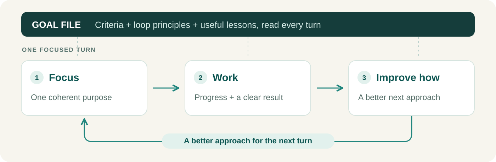

<p align="center">
  
</p>

<h1 align="center">Light Loop</h1>

<div align="center">

[](https://github.com/game-dev-rta-club/light-loop/actions/workflows/ci.yml)
[](https://github.com/game-dev-rta-club/light-loop/releases/latest)
[](LICENSE)

</div>

**Give your agent a goal. It keeps working—and improves its approach as it goes.**

A skill for lightweight loop engineering with Codex or Claude Code: one agent, focused work, and a better approach each turn. Useful for bug fixes, performance work and visual polish.

## Make progress beyond a single reply

Describe the outcome. The agent's native goal feature (Codex **Goal** or Claude Code **`/goal`**) continues the work across focused cycles called turns, with one clear purpose per turn. The loop ends when the agreed goal is achieved.



## Improve the approach each turn

Before a turn ends, the agent improves **how it works** next. A **goal file** carries the completion criteria, loop principles and useful lessons forward. The goal itself stays fixed and tells the agent to read the file at the start of every turn, so the file is not forgotten in long runs. To steer the work, edit the file.

For example: switch from full-page screenshots to close-ups when judging a small UI defect.

## Keep the loop lightweight

One skill, one agent, no separate runner. Avoid extra tokens and handoff delays from coordinating workers. Total cost and speed still depend on the task.

For delegation and independent reviews, see [Codex Small Loop](https://github.com/game-dev-rta-club/codex-small-loop).

## Install and use

From your project:

```sh
npx skills@latest add game-dev-rta-club/light-loop \
  --skill light-loop \
  --agent codex claude-code \
  --yes
```

List only the agents you use.

```text
$light-loop Fix the search bottleneck and get the existing performance tests
passing without changing search results.
```

In Claude Code, start with `/light-loop` instead of `$light-loop`. The skill includes a small Claude Code plugin that gives the loop Codex-style goal tools, so the loop starts without typing `/goal`. It loads in trusted projects from the next session after installing; without it, Claude Code asks you to approve the goal or to run the `/goal` command it prepares. Stop the loop with `/light-loop-stop`.

**Requires:** Codex with native Goal tools, or Claude Code with `/goal`, plus Node.js, npm and Git for installation. The skill is [one Markdown file](skills/light-loop/SKILL.md) with a [Claude Code plugin](skills/light-loop/hooks/register.ts) beside it, installed project-locally. Refresh the agent's skill list to use it.

## Update

Rerun the install command to update. Updates are explicit, not automatic. See the [release notes](CHANGELOG.md).

<details>
<summary>Install a specific release</summary>

```sh
npx skills@latest add https://github.com/game-dev-rta-club/light-loop/tree/v0.2.0/skills/light-loop \
  --agent codex claude-code --yes
```

</details>

## Project

[Game Dev RTA Club](https://github.com/game-dev-rta-club) · [MIT](LICENSE) · [Contributing](CONTRIBUTING.md) · [Code of Conduct](CODE_OF_CONDUCT.md) · [Security](SECURITY.md)
